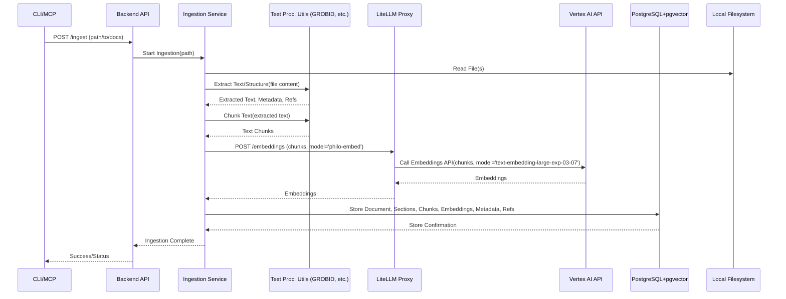
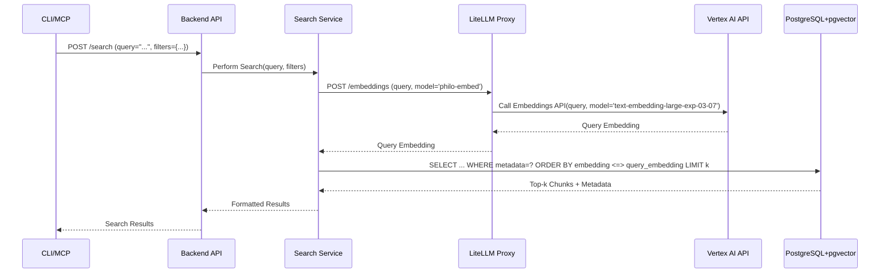

# PhiloGraph Tier 0 MVP Architecture (Spec v2.3)

This document outlines the architectural design for the PhiloGraph Tier 0 Minimum Viable Product (MVP), based on `docs/project-specifications.md` v2.3.

**Core Principles (Tier 0):**

*   **Local Deployment:** All core components run within a local Docker environment.
*   **Cloud Embeddings via Proxy:** Leverages free-tier cloud embeddings (Vertex AI) accessed through a local LiteLLM proxy for high-quality semantic search without local GPU requirements.
*   **Unified API Gateway:** Establishes LiteLLM as the central proxy for all external LLM/embedding calls from the outset.
*   **CPU-Bound Processing:** Text extraction and processing rely on CPU-based tools.
*   **Modularity:** Components are designed with separation of concerns to facilitate future migration to cloud-native architectures (Tier 1+).
*   **No LangChain:** Tier 0 utilizes standard Python logic and direct interaction with components. LangChain is planned for selective introduction in Tier 1+.

## 1. High-Level Component Diagram

```mermaid
graph TD
    subgraph "User Interfaces (Local)"
        CLI[CLI Client]
        MCPServer[MCP Server (Local)]
    end

    subgraph "Backend Service (Docker)"
        style Backend Service fill:#ccf,stroke:#333,stroke-width:2px
        API[Backend API (Flask/FastAPI)]
        IngestionService[Ingestion Service]
        SearchService[Search Service]
        RelationService[Relationship Service (Basic)]
        BiblioService[Bibliography Service (Basic)]
    end

    subgraph "Text Processing Utilities (Docker / within Backend)"
        style Text Processing Utilities fill:#fcc,stroke:#333,stroke-width:2px
        GROBID[GROBID (CPU)]
        PyMuPDF[PyMuPDF/ebooklib]
        SemChunk[semchunk (CPU)]
        AnyStyle[AnyStyle (Optional)]
    end

    subgraph "Middleware (Docker)"
        style Middleware fill:#cfc,stroke:#333,stroke-width:2px
        LiteLLMProxy[LiteLLM Proxy]
    end

    subgraph "Storage (Docker)"
        style Storage fill:#f9d,stroke:#333,stroke-width:2px
        PostgresDB[(PostgreSQL + pgvector)]
    end

    subgraph "External Cloud Services"
        style External Cloud Services fill:#eee,stroke:#666,stroke-width:1px
        VertexAI{{Cloud Embedding API<br/>(Vertex AI - text-embedding-large-exp-03-07)}}
    end

    subgraph "Local Filesystem"
        style Local Filesystem fill:#ddd,stroke:#666,stroke-width:1px
        SourceFiles[/Source Documents/]
    end

    %% Connections
    CLI --> API
    MCPServer --> API

    API -- Orchestrates --> IngestionService
    API -- Orchestrates --> SearchService
    API -- Orchestrates --> RelationService
    API -- Orchestrates --> BiblioService

    IngestionService -- Uses --> GROBID
    IngestionService -- Uses --> PyMuPDF
    IngestionService -- Uses --> SemChunk
    IngestionService -- Uses --> AnyStyle
    IngestionService -- Reads --> SourceFiles
    IngestionService -- Requests Embeddings --> LiteLLMProxy
    IngestionService -- Writes --> PostgresDB

    SearchService -- Requests Embeddings --> LiteLLMProxy
    SearchService -- Queries --> PostgresDB

    RelationService -- Reads/Writes --> PostgresDB
    BiblioService -- Reads/Writes --> PostgresDB

    LiteLLMProxy -- Calls --> VertexAI
```

## 2. Component Responsibilities

*   **User Interfaces (Local):**
    *   **CLI Client:** Provides command-line access for ingestion, search, and basic management tasks. Interacts with the Backend API.
    *   **MCP Server:** Exposes PhiloGraph functionality as tools for AI agents (e.g., RooCode). Interacts with the Backend API.
*   **Backend Service (Docker - Flask/FastAPI):**
    *   **Backend API:** Exposes REST endpoints for UI/MCP interaction. Orchestrates calls to internal services.
    *   **Ingestion Service:** Manages the document processing pipeline. Coordinates text extraction, chunking, embedding requests (via LiteLLM Proxy), and database indexing.
    *   **Search Service:** Handles search queries. Generates query embeddings (via LiteLLM Proxy), performs vector and metadata searches against the database.
    *   **Relationship Service (Basic):** Manages storage and retrieval of explicit relationships (primarily citations) in the database using SQL.
    *   **Bibliography Service (Basic):** Manages user collections and provides basic citation formatting support.
*   **Text Processing Utilities (Docker / within Backend):**
    *   **GROBID (CPU):** Parses PDFs for structure, metadata, text content, and bibliography. Runs as a separate container or integrated library.
    *   **PyMuPDF/ebooklib:** Extracts text and structure from EPUB files.
    *   **semchunk (CPU):** Performs semantic chunking of extracted text.
    *   **AnyStyle (Optional):** Parses citation strings if GROBID output needs refinement. Runs as a separate container or integrated library.
*   **Middleware (Docker):**
    *   **LiteLLM Proxy:** Acts as the **sole gateway** for all external embedding API calls. Manages API keys (via Virtual Keys), routes requests to Vertex AI (`text-embedding-large-exp-03-07`), handles retries, rate limits, and potentially cost tracking. Provides an OpenAI-compatible endpoint for internal services.
*   **Storage (Docker):**
    *   **PostgreSQL + pgvector:** Stores all structured data: document metadata, sections, text chunks, embeddings, relationships, collections. Provides relational querying and vector search capabilities.
*   **External Cloud Services:**
    *   **Vertex AI Embeddings API:** Google Cloud service providing the `text-embedding-large-exp-03-07` model. Accessed exclusively via the LiteLLM Proxy.
*   **Local Filesystem:**
    *   **Source Documents:** Location of the original PDF, EPUB, MD, TXT files provided by the user for ingestion.

## 3. Key Workflows (Sequence Diagrams)

### 3.1 Ingestion Workflow



### 3.2 Search Workflow



## 4. Data Flow & Communication Protocols

*   **Internal Communication:** Primarily RESTful HTTP calls between the UI/MCP layer and the Backend API, and between Backend services (if split into separate containers, though likely monolithic initially) or between the Backend and dedicated Text Processing containers (e.g., GROBID).
*   **Embedding Requests:** Backend services (Ingestion, Search) make HTTP POST requests to the **LiteLLM Proxy's OpenAI-compatible endpoint** (`http://{{LITELLM_HOST}}:{{LITELLM_PORT}}/embeddings`), specifying the internal model name (`philo-embed`) which LiteLLM maps to `vertex_ai/text-embedding-large-exp-03-07`.
*   **External API Calls:** The **LiteLLM Proxy** is the *only* component making direct calls to external cloud services (Vertex AI API) via HTTPS.
*   **Database Interaction:** Backend services interact with PostgreSQL using standard SQL queries via a Python DB driver (e.g., `psycopg2`). Vector searches utilize `pgvector`'s specific operators (e.g., `<=>` for L2 distance, `<#>` for negative inner product, `<->` for cosine distance).
*   **Data Format:** JSON is the primary format for API request/response bodies. Text data is processed as UTF-8 strings. Embeddings are stored as `vector` types in PostgreSQL (Recommended dimension: **768**, pending validation, e.g., `vector(768)`).

## 5. Modularity & Tier 1 Migration Considerations

This Tier 0 architecture is designed with future migration to Tier 1 (Cloud Serverless) in mind:

*   **Containerization:** Using Docker for all components simplifies packaging and deployment, whether locally or in cloud container environments.
*   **API-First Backend:** The Flask/FastAPI backend provides a clear interface. This logic can be migrated relatively easily to serverless functions (e.g., AWS Lambda, Google Cloud Functions) that expose similar HTTP endpoints.
*   **Database Choice (Postgres):** PostgreSQL has excellent managed serverless options (Supabase, NeonDB, AWS RDS Serverless v2, Google Cloud SQL). Migrating the schema and data from local Docker Postgres to a cloud equivalent is a well-understood process.
*   **LiteLLM Proxy Pattern:** Establishing the LiteLLM proxy as the central gateway *in Tier 0* is crucial. For Tier 1, this proxy itself will be deployed serverlessly (e.g., on Cloud Run, Azure Container Apps, or Fargate), and the serverless functions containing the backend logic will simply point to the new cloud-based proxy endpoint. This isolates the application from embedding provider specifics.
*   **Separation of Concerns:**
    *   The **Ingestion Service** logic can be refactored into one or more serverless functions triggered by events (e.g., file uploads to cloud storage).
    *   The **Search Service** logic maps well to an API Gateway endpoint backed by a serverless function.
    *   **Text Processing Utilities** (GROBID, etc.) might remain containerized services called by serverless functions, or potentially replaced by cloud-native equivalents if available/cost-effective.
*   **Configuration Management:** Using environment variables and avoiding hardcoding (Section 6.10 of spec) makes reconfiguration for cloud environments straightforward. Cloud platforms provide mechanisms for injecting secrets and environment variables into serverless functions and containers.
*   **LangChain Introduction (Tier 1+):** The modular backend allows for the *selective* introduction of LangChain within specific serverless functions (e.g., for orchestrating the ingestion pipeline using LCEL or implementing a Q&A chain) without disrupting the entire architecture. Crucially, any LangChain components will still route external calls through the deployed LiteLLM proxy.

By adhering to these principles, the Tier 0 MVP provides immediate value while minimizing the technical debt associated with migrating to a more scalable and robust cloud-native architecture in Tier 1.