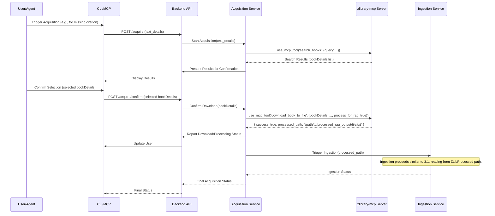

# PhiloGraph Tier 0 MVP Architecture (Spec v2.3)

This document outlines the architectural design for the PhiloGraph Tier 0 Minimum Viable Product (MVP), based on `docs/project-specifications.md` v2.3.

**Core Principles (Tier 0):**

*   **Local Deployment:** All core components run within a local Docker environment.
*   **Cloud Embeddings via Proxy:** Leverages free-tier cloud embeddings (Vertex AI) accessed through a local LiteLLM proxy for high-quality semantic search without local GPU requirements.
*   **Unified API Gateway:** Establishes LiteLLM as the central proxy for all external LLM/embedding calls from the outset.
*   **CPU-Bound Processing:** Text extraction and processing rely on CPU-based tools.
*   **External Text Acquisition:** Integrates with the external `zlibrary-mcp` server for acquiring missing texts.
*   **Modularity:** Components are designed with separation of concerns to facilitate future migration to cloud-native architectures (Tier 1+).
*   **No LangChain:** Tier 0 utilizes standard Python logic and direct interaction with components. LangChain is planned for selective introduction in Tier 1+.

## 1. High-Level Component Diagram

```mermaid
graph TD
    subgraph "User Interfaces (Local)"
        CLI[CLI Client]
        MCPServer[PhiloGraph MCP Server (Local)]
    end

    subgraph "Backend Service (Docker)"
        style Backend Service fill:#ccf,stroke:#333,stroke-width:2px
        API[Backend API (Flask/FastAPI)]
        IngestionService[Ingestion Service]
        SearchService[Search Service]
        RelationService[Relationship Service (Basic)]
        BiblioService[Bibliography Service (Basic)]
        AcquisitionService[Text Acquisition Service]
    end

    subgraph "Text Processing Utilities (Docker / within Backend)"
        style Text Processing Utilities fill:#fcc,stroke:#333,stroke-width:2px
        GROBID[GROBID (CPU)]
        PyMuPDF[PyMuPDF/ebooklib]
        SemChunk[semchunk (CPU)]
        AnyStyle[AnyStyle (Optional)]
    end

    subgraph "Middleware (Docker)"
        style Middleware fill:#cfc,stroke:#333,stroke-width:2px
        LiteLLMProxy[LiteLLM Proxy (Embeddings)]
    end

    subgraph "Storage (Docker)"
        style Storage fill:#f9d,stroke:#333,stroke-width:2px
        PostgresDB[(PostgreSQL + pgvector)]
    end

    subgraph "External Cloud Services"
        style External Cloud Services fill:#eee,stroke:#666,stroke-width:1px
        VertexAI{{Cloud Embedding API<br/>(Vertex AI - text-embedding-large-exp-03-07)}}
    end

    subgraph "External MCP Servers (Local)"
        style External MCP Servers fill:#e9e,stroke:#666,stroke-width:1px
        ZLibMCP[zlibrary-mcp Server]
    end

    subgraph "Local Filesystem"
        style Local Filesystem fill:#ddd,stroke:#666,stroke-width:1px
        SourceFiles[/Source Documents/]
        ZLibDownloads[/zlibrary Downloads/]
        ZLibProcessed[/zlibrary Processed RAG/]
    end

    %% Connections
    CLI --> API
    MCPServer --> API

    API -- Orchestrates --> IngestionService
    API -- Orchestrates --> SearchService
    API -- Orchestrates --> RelationService
    API -- Orchestrates --> BiblioService
    API -- Orchestrates --> AcquisitionService

    IngestionService -- Uses --> GROBID
    IngestionService -- Uses --> PyMuPDF
    IngestionService -- Uses --> SemChunk
    IngestionService -- Uses --> AnyStyle
    IngestionService -- Reads --> SourceFiles
    IngestionService -- Reads --> ZLibProcessed
    IngestionService -- Requests Embeddings --> LiteLLMProxy
    IngestionService -- Writes --> PostgresDB

    SearchService -- Requests Embeddings --> LiteLLMProxy
    SearchService -- Queries --> PostgresDB

    RelationService -- Reads/Writes --> PostgresDB
    BiblioService -- Reads/Writes --> PostgresDB

    AcquisitionService -- Calls via MCP --> ZLibMCP
    ZLibMCP -- Writes --> ZLibDownloads
    ZLibMCP -- Writes --> ZLibProcessed

    LiteLLMProxy -- Calls --> VertexAI
```

## 2. Component Responsibilities

*   **User Interfaces (Local):**
    *   **CLI Client:** Provides command-line access for ingestion, search, basic management, and **text acquisition** tasks. Interacts with the Backend API.
    *   **PhiloGraph MCP Server:** Exposes PhiloGraph functionality (ingestion, search, **acquisition**) as tools for AI agents (e.g., RooCode). Interacts with the Backend API.
*   **Backend Service (Docker - Flask/FastAPI):**
    *   **Backend API:** Exposes REST endpoints for UI/MCP interaction (e.g., `/ingest`, `/search`, `/acquire`). Orchestrates calls to internal services and external MCP servers (`zlibrary-mcp`).
    *   **Ingestion Service:** Manages the document processing pipeline for *provided* source files and *acquired* processed files. Coordinates text extraction, chunking, embedding requests (via LiteLLM Proxy), and database indexing.
    *   **Search Service:** Handles search queries. Generates query embeddings (via LiteLLM Proxy), performs vector and metadata searches against the database.
    *   **Relationship Service (Basic):** Manages storage and retrieval of explicit relationships (primarily citations) in the database using SQL. Identifies potentially missing cited texts.
    *   **Bibliography Service (Basic):** Manages user collections and provides basic citation formatting support.
    *   **Text Acquisition Service:** Orchestrates the workflow for acquiring missing texts. Interacts with the `zlibrary-mcp` server via `use_mcp_tool` to search, download, and process texts. Handles user confirmation (Tier 0) and triggers ingestion of the processed file.
*   **Text Processing Utilities (Docker / within Backend):**
    *   **GROBID (CPU):** Parses PDFs for structure, metadata, text content, and bibliography. Runs as a separate container or integrated library.
    *   **PyMuPDF/ebooklib:** Extracts text and structure from EPUB files.
    *   **semchunk (CPU):** Performs semantic chunking of extracted text.
    *   **AnyStyle (Optional):** Parses citation strings if GROBID output needs refinement. Runs as a separate container or integrated library.
*   **Middleware (Docker):**
    *   **LiteLLM Proxy:** Acts as the **sole gateway** for all external *embedding* API calls. Manages API keys (via Virtual Keys), routes requests to Vertex AI (`text-embedding-large-exp-03-07`), handles retries, rate limits, and potentially cost tracking. Provides an OpenAI-compatible endpoint for internal services.
*   **Storage (Docker):**
    *   **PostgreSQL + pgvector:** Stores all structured data: document metadata, sections, text chunks, embeddings, relationships, collections. Provides relational querying and vector search capabilities.
*   **External Cloud Services:**
    *   **Vertex AI Embeddings API:** Google Cloud service providing the `text-embedding-large-exp-03-07` model. Accessed exclusively via the LiteLLM Proxy.
*   **External MCP Servers (Local):**
    *   **zlibrary-mcp Server:** An external, separately running MCP server (Node.js/Python) responsible for interacting with Z-Library. Provides tools like `search_books`, `download_book_to_file`, and `process_document_for_rag`. Called by the PhiloGraph Backend Service via `use_mcp_tool`. Requires its own setup and configuration.
*   **Local Filesystem:**
    *   **Source Documents:** Location of the original PDF, EPUB, MD, TXT files provided by the user for ingestion.
    *   **zlibrary Downloads:** Default output directory for raw files downloaded by `zlibrary-mcp`.
    *   **zlibrary Processed RAG:** Default output directory for plain text files processed by `zlibrary-mcp`'s RAG pipeline. PhiloGraph Ingestion Service reads from here for acquired texts.

## 3. Key Workflows (Sequence Diagrams)

### 3.1 Ingestion Workflow (Standard)


### 3.2 Search Workflow


### 3.3 Text Acquisition Workflow (via zlibrary-mcp)



## 4. Data Flow & Communication Protocols

*   **Internal Communication:** Primarily RESTful HTTP calls between the UI/MCP layer and the Backend API, and between Backend services (if split into separate containers, though likely monolithic initially) or between the Backend and dedicated Text Processing containers (e.g., GROBID).
*   **Embedding Requests:** Backend services (Ingestion, Search) make HTTP POST requests to the **LiteLLM Proxy's OpenAI-compatible endpoint** (`http://{{LITELLM_HOST}}:{{LITELLM_PORT}}/embeddings`), specifying the internal model name (`philo-embed`) which LiteLLM maps to `vertex_ai/text-embedding-large-exp-03-07`.
*   **Text Acquisition Requests:** The Backend Service (Acquisition Service) communicates with the **`zlibrary-mcp` Server** using the Model Context Protocol (MCP) via `use_mcp_tool` calls, likely over stdio.
*   **External API Calls:** The **LiteLLM Proxy** is the *only* component making direct calls to external cloud services (Vertex AI API) via HTTPS.
*   **Database Interaction:** Backend services interact with PostgreSQL using standard SQL queries via a Python DB driver (e.g., `psycopg2`). Vector searches utilize `pgvector`'s specific operators (e.g., `<=>` for L2 distance, `<#>` for negative inner product, `<->` for cosine distance).
*   **Data Format:** JSON is the primary format for API request/response bodies and MCP tool arguments/results. Text data is processed as UTF-8 strings. Embeddings are stored as `vector` types in PostgreSQL (Recommended dimension: **768**, pending validation, e.g., `vector(768)`).

## 5. Modularity & Tier 1 Migration Considerations

This Tier 0 architecture is designed with future migration to Tier 1 (Cloud Serverless) in mind:

*   **Containerization:** Using Docker for PhiloGraph components simplifies packaging and deployment. `zlibrary-mcp` runs separately but its MCP interface provides decoupling.
*   **API-First Backend:** The Flask/FastAPI backend provides a clear interface. This logic can be migrated relatively easily to serverless functions.
*   **Database Choice (Postgres):** PostgreSQL has excellent managed serverless options.
*   **LiteLLM Proxy Pattern:** Crucial for isolating embedding provider specifics. Can be deployed serverlessly in Tier 1.
*   **`zlibrary-mcp` Integration:** The MCP interface provides a stable contract. The `zlibrary-mcp` server itself could potentially be containerized and run in the cloud (e.g., Cloud Run, Fargate) alongside the migrated PhiloGraph components in Tier 1+, or replaced if a different acquisition source is chosen. The PhiloGraph backend only needs the MCP server endpoint updated.
*   **Separation of Concerns:**
    *   Ingestion, Search, Acquisition logic maps well to serverless functions.
    *   Text Processing Utilities might remain containerized or be replaced.
*   **Configuration Management:** Using environment variables facilitates cloud migration.
*   **LangChain Introduction (Tier 1+):** Can be introduced selectively within serverless functions, still routing external calls via LiteLLM.

By adhering to these principles, the Tier 0 MVP provides immediate value while minimizing the technical debt associated with migrating to a more scalable and robust cloud-native architecture in Tier 1.