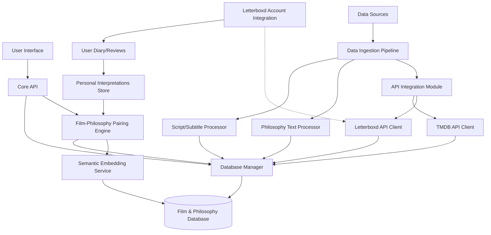
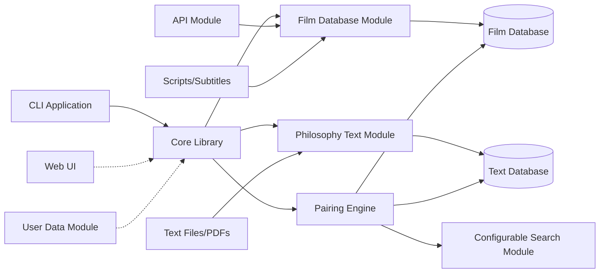
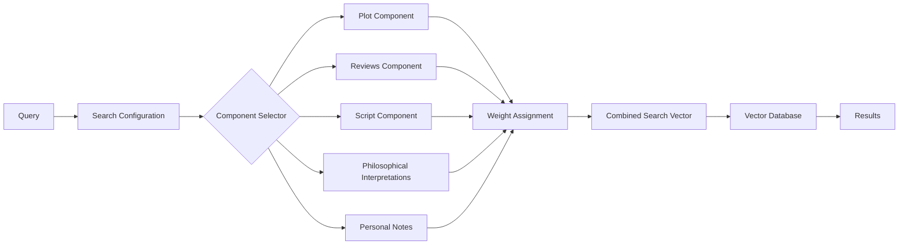
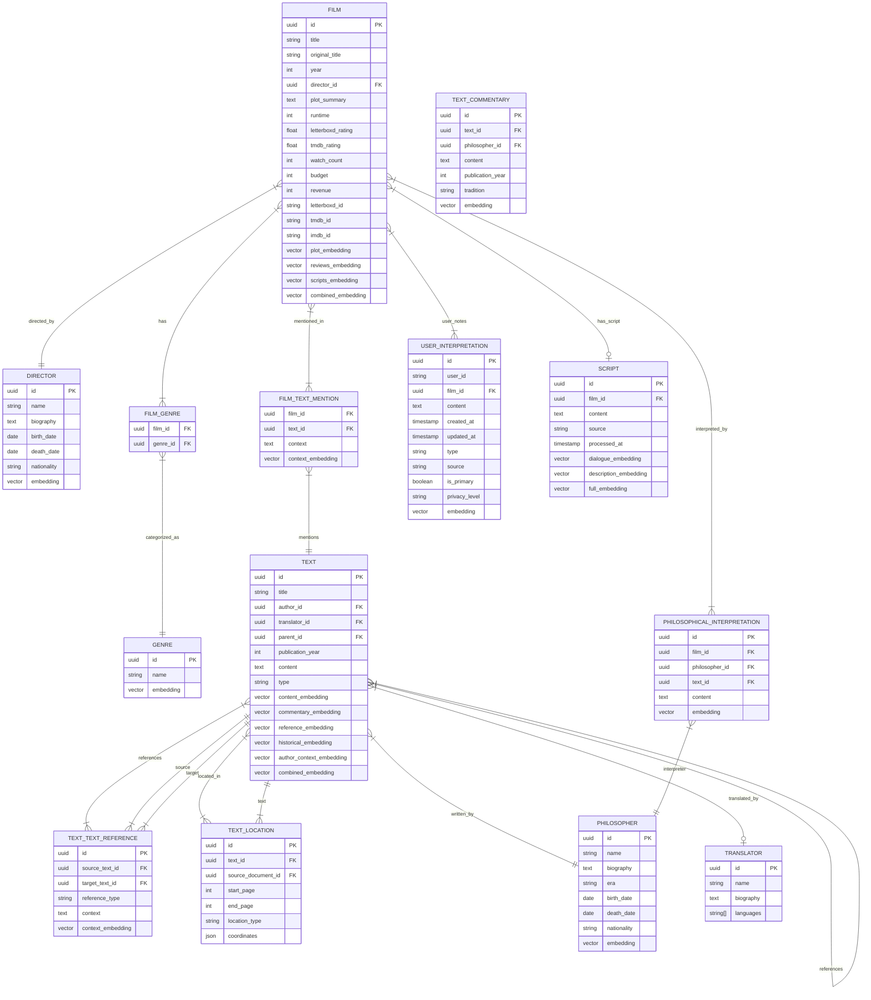

# The Film Philosopher - Project Specifications

## 1. Project Overview

**The Film Philosopher** is a library and CLI application that connects philosophical texts with films through semantic analysis, creating thoughtful pairings for educational and exploratory purposes. The system enables users to discover films based on philosophical readings, find relevant philosophical texts for films they enjoy, or explore text-film combinations related to specific themes.

### Core Functionality
- Match philosophical texts with thematically related films
- Recommend the best N films for a specific philosophical text
- Recommend the best N texts for a specific film
- Recommend N text-film combinations based on a theme
- Allow filtering and customization of recommendations
- Maintain a comprehensive, interconnected database of films and philosophical texts
- Enable integration with Letterboxd for creating recommendation playlists and managing personal notes

## 2. System Architecture





## 3. Core Components

### 3.1. Database Module

#### 3.1.1. Database Technology: PostgreSQL with pgvector

We'll use a hybrid approach with PostgreSQL and its pgvector extension for several reasons:

- **Relationship Management**: PostgreSQL offers robust relational capabilities for modeling the complex relationships between films, directors, texts, philosophers, etc.
- **Vector Search**: pgvector provides efficient similarity search for embeddings
- **Transaction Support**: Ensures data integrity during complex operations
- **Scalability**: Can scale to handle large collections of texts and films
- **Extensibility**: Supports adding custom functions and types
- **Open Source**: No licensing costs or vendor lock-in

Implementation details:
- Use foreign keys to maintain relationship integrity
- Create dedicated tables for films, directors, texts, philosophers, etc.
- Use pgvector's vector type for storing embeddings
- Implement appropriate indexes for efficient querying

### 3.2. Data Ingestion Pipeline

#### 3.2.1. API Integration Module

This module will coordinate data collection from multiple film data sources:

**Letterboxd API Client**
- Implements authenticated access to the Letterboxd API
- Handles rate limiting (implements backoff strategies)
- Processes film data including:
  - Basic metadata (title, year, rating)
  - User reviews (sorted by popularity)
  - Genre information
- Extracts longer, more thoughtful reviews using length as a proxy
- Manages OAuth2 authentication for future account integration
- Retrieves user diary entries and reviews when authenticated
- Captures dates of entries for determining most recent views

**TMDB API Client**
- Implements authenticated access to the TMDB API
- Respects rate limits (40 requests per 10 seconds)
- Supplements Letterboxd data with:
  - Original and translated film titles (First Party restricted in Letterboxd)
  - Complete director information and filmographies
  - Budget and revenue information
  - More detailed genre and keyword data
  - Cast and crew details
  - Film collection information (series/franchises)

**Data Reconciliation Engine**
- Matches films across both APIs using IMDb IDs
- Resolves conflicting information with priority rules
- Combines unique data points from each source
- Handles error cases when films exist in one API but not the other

#### 3.2.2. Philosophy Text Processor
- Parses and processes philosophical texts from various formats (initially markdown/text)
- Creates hierarchical text entries (books → chapters → sections)
- Establishes cross-references between texts
- Handles missing references and placeholder entries
- Detects film mentions in texts for bidirectional linking

#### 3.2.3. Script/Subtitle Processor
- Acquires film scripts and subtitles from available sources
- Processes and cleans textual content
- Handles different subtitle formats (SRT, VTT, etc.)
- Structures dialogue data in queryable format
- Generates embeddings from script content
- Implements selective processing strategy to manage costs
- Prioritizes processing based on film relevance to philosophy texts

The prioritization of film script processing will be based on a combined score derived from:
1. Mention count in philosophical texts (higher = higher priority)
2. Letterboxd popularity score (higher = higher priority)
3. Philosophical relevance score based on existing film metadata (calculated from plot summary and reviews)
4. User request frequency (tracks how often users attempt to include script components)

This prioritization system ensures efficient resource utilization by processing scripts for films most likely to benefit from this additional context.

### 3.3. Semantic Analysis Engine

#### 3.3.1. Embedding Model Options

We'll implement a flexible embedding framework that supports multiple models:

**Google Gemini Embeddings**
- **Pros**: Cost-efficient, good performance, suited for varied content types
- **Cons**: May require custom API implementation, less specialized for academic texts

**OpenAI Embedding Models**
- **Pros**: High performance, excellent documentation, widely used
- **Cons**: Higher cost, API rate limitations

**Open-Source Models (e.g., SBERT)**
- **Pros**: No API costs, full local control, customizable
- **Cons**: May require more computational resources, potentially lower quality

**Hybrid Approach**
- Use different models for different content types
- Philosophy texts: Academic-focused models
- Film descriptions: General-purpose models

Implementation:
- Abstract embedding interface to allow model switching
- Cache embeddings to reduce API costs
- Implement batch processing for efficiency

#### 3.3.1.1. Model Selection Criteria
- **Initial Implementation**: Google Gemini embeddings will serve as the primary model due to cost efficiency and good performance
- **Evaluation Metrics**:
  - Semantic relevance for philosophy-film pairings
  - Processing cost per 1,000 tokens
  - Response time for embedding generation
- **Switchover Criteria**: Model switching will occur if:
  - Relevance scores fall below threshold (< 0.7 precision@10)
  - Cost increases by more than 30%
  - Response time exceeds 500ms for standard inputs

#### 3.3.2. Modular Embedding Architecture

To support configurable search across different aspects of films and texts:

- **Component-based Embeddings**: Generate separate embeddings for:
  - Film plot/synopsis
  - Film reviews (general public)
  - Film scripts/subtitles
  - Philosophical interpretations (per philosopher)
  - Technical aspects (cinematography, direction style)
  
- **Configurable Search Engine**:
  - Allow selecting which embedding components to include in search
  - Support for weighting different components
  - Enable filtering by specific philosophers' interpretations
  - Support for personalized search including user notes/reviews

### 3.4. Recommendation Engine

#### 3.4.1. Multi-directional Recommendation System
- **Film → Text**: Find philosophical texts relevant to a film
- **Text → Film**: Find films that match themes in philosophical texts
- **Theme → Both**: Find film-text pairs relevant to a theme

#### 3.4.2. Recommendation Configuration
- Applies filters based on user preferences
- Configurable weighting of different aspects (plot, philosophical interpretation, etc.)
- Option to include/exclude specific philosopher interpretations
- Integration with user's personal notes and Letterboxd diary entries
- Explainable recommendations with similarity metrics
- Support for "discovery mode" to find unexpected connections

#### 3.4.2.1. Letterboxd Authentication Flow
- **OAuth 2.0 Implementation**:
  1. Authorization Code Request: Redirect user to Letterboxd authorization page
  2. User Consent: User authenticates and approves requested scopes
  3. Authorization Code Exchange: Backend exchanges code for access/refresh tokens
  4. Token Storage: Encrypted storage of refresh token with user consent
  5. Token Refresh: Automatic refresh before expiration
- **Session Management**:
  - Session duration: 30 days with activity
  - Idle timeout: 7 days of inactivity
  - Multiple device support with session listing/revocation

### 3.5. CLI Application
- Provides interface for querying the system
- Supports all recommendation directions
- Implements filtering options based on metadata from both APIs
- Displays recommendations with explanations
- Structured for future extension to web interface
- Supports exporting recommendations to various formats

### 3.6. Error Handling and Resilience

#### 3.6.1. API Error Handling
- Implement circuit breaker pattern for external API calls
- Define retry policies with exponential backoff:
  - Initial delay: 1 second
  - Maximum delay: 60 seconds
  - Maximum retries: 5
- Fallback strategy when APIs are unavailable:
  - Cache most recent successful responses
  - Provide clear user feedback about partial data
  - Queue operations for later retry when appropriate

#### 3.6.2. Database Resilience
- Implement connection pooling with health checks
- Handle database unavailability with graceful degradation
- Use read replicas where appropriate for high-availability
- Monitor and log database performance metrics

#### 3.6.3. User Input Error Handling
- Comprehensive input validation with clear error messages
- Structured error responses with:
  - Error code
  - User-friendly message
  - Detailed description (for developers)
  - Suggested remediation steps

#### 3.6.4. Recovery Mechanisms
- Transaction management for multi-step operations
- Auto-recovery for interrupted embedding generation
- Periodic consistency checks between related data
- Self-healing capability for common error conditions

### 3.7. Data Validation and Quality Assurance

#### 3.7.1. Input Validation Strategies
- Schema-based validation for all API inputs
- Type checking and constraint enforcement
- Custom validators for domain-specific entities:
  - Film metadata validation (year ranges, plausible runtimes)
  - Text content validation (minimum length, format checks)
  - Embedding dimension validation

#### 3.7.2. Quality Control for External Data
- Letterboxd data quality checks:
  - Completeness checks for required fields
  - Heuristic validation of ratings and review counts
  - Detection of anomalous data patterns
  
- TMDB data quality checks:
  - Cross-reference validation with Letterboxd data
  - Completeness assessment for critical fields
  - Date format standardization and validation

#### 3.7.3. Philosophy Text Quality Assurance
- Structural integrity validation for hierarchical texts
- Reference consistency checks
- Language detection to confirm expected language
- Minimum quality thresholds for generated embeddings
- Plagiarism detection for user-contributed content

#### 3.7.4. Embedding Quality Metrics
- Distribution analysis of vector spaces
- Outlier detection for potentially erroneous embeddings
- Clustering validation to ensure meaningful grouping
- Periodic revalidation of older embeddings against newer models

### 3.8. Testing Strategy

#### 3.8.1. Unit Testing
- Test coverage targets: minimum 80% line coverage
- Critical component coverage target: 95%
- Unit test organization mirrors application structure
- Mock external dependencies (APIs, embedding services)
- Property-based testing for data transformation functions

#### 3.8.2. Integration Testing
- API integration test suite:
  - End-to-end tests for all public endpoints
  - Authentication flow validation
  - Rate limiting behavior verification
  
- Database integration tests:
  - Transaction integrity tests
  - Concurrent operation tests
  - Vector search accuracy validation

#### 3.8.3. Recommendation Quality Testing
- Golden set validation:
  - Curated set of film-text pairs with known relevance
  - Regression testing against this set
  
- Human evaluation framework:
  - Blind comparison of recommendation approaches
  - Relevance scoring protocol
  - Periodic evaluation of recommendation quality

#### 3.8.4. Performance Testing
- **Initial Load Testing**:
  - Target: Support 10-20 simultaneous queries
  - Response time under normal load < 1 second
  - Test with realistic dataset sizes (hundreds of films, dozens of texts)

- **Scalability Monitoring**:
  - Track query times as dataset grows
  - Establish performance baselines at regular intervals
  - Document performance characteristics at different scale points
  - Implement logging of slow queries (> 1 second)

- **Incremental Testing**:
  - Re-test when dataset reaches key milestones:
    - 1,000 films
    - 100 philosophical texts
    - 1,000 user interpretations
  - Adjust indexing and caching strategies based on results

- **Continuous Performance Monitoring**:
  - Track 95th percentile response times for all API endpoints
  - Monitor embedding generation times
  - Alert on performance degradation beyond established thresholds
  - Record database query plans for common operations

#### 3.8.5. Continuous Integration
- Automated test execution on each commit
- Weekly full regression test suite
- Performance benchmark tracking over time
- Code quality metrics monitoring

### 3.9. Dependency Management

#### 3.9.1. External Dependencies
- Core dependencies:
  - PostgreSQL client (psycopg2 or asyncpg)
  - Vector operations (pgvector)
  - HTTP client (requests or httpx)
  - Embedding API clients (OpenAI, Google)
  - Text processing (NLTK, spaCy)

- Dependency isolation:
  - Docker containers for consistent environments
  - Virtual environments for development
  - Explicit version pinning for all dependencies

#### 3.9.2. Version Management
- Semantic versioning for the application
- Dependency update policy:
  - Security updates: Immediate
  - Minor updates: Monthly review
  - Major updates: Quarterly review with testing

#### 3.9.3. Compatibility Matrix
- Python version compatibility: 3.9+
- PostgreSQL version compatibility: 12+
- pgvector version requirements: 0.4.0+
- OS compatibility: Linux (primary), macOS, Windows (with Docker)

### 3.10. Logging and Monitoring

#### 3.10.1. Logging Framework
- Structured logging with JSON format
- Log levels:
  - ERROR: System errors requiring attention
  - WARNING: Potential issues not affecting core functionality
  - INFO: Standard operational information
  - DEBUG: Detailed information for troubleshooting
- Contextual information in all logs:
  - Timestamp
  - Component ID
  - Operation ID
  - User ID (when applicable)

#### 3.10.2. Key Metrics
- System health metrics:
  - API response times (p50, p95, p99)
  - Database query performance
  - Embedding generation time
  - Error rates by component
  
- Business metrics:
  - Recommendations generated
  - User engagement metrics
  - Data growth over time
  - Component usage patterns

#### 3.10.3. Alerting Strategy
- Critical alerts:
  - Service unavailability
  - Error rate exceeding thresholds
  - Database connection failures
  - API quota approaching limits
  
- Warning alerts:
  - Slow performance (response time > 2s)
  - Embedding generation failures
  - Unusual traffic patterns
  - Data quality issues

### 3.11. Security Considerations

#### 3.11.1. API Key Management
- API keys stored in environment variables or secrets manager
- Key rotation schedule:
  - Development keys: Monthly
  - Production keys: Quarterly
- Access scope limitation for external API keys

#### 3.11.2. User Data Protection
- Personally identifiable information (PII) minimization
- Privacy controls for user-generated content
- Data retention policies:
  - User data: Retained until account deletion
  - Usage logs: 90 days
  - Error logs: 30 days

#### 3.11.3. Input Sanitization
- HTML/Markdown sanitization for user inputs
- SQL injection prevention
- Parameter validation and type checking
- Rate limiting for public endpoints

#### 3.11.4. Authentication and Authorization
- OAuth 2.0 implementation for Letterboxd integration
- Token-based authentication for API access
- Role-based access control for future multi-user system
- Session management and timeout policies

### 3.12. Backup and Recovery

#### 3.12.1. Database Backup Strategy
- Daily full backups of PostgreSQL database
- Point-in-time recovery capability with WAL archiving
- Backup retention policy:
  - Daily backups: 7 days
  - Weekly backups: 1 month
  - Monthly backups: 1 year

#### 3.12.2. Embedding Model Versioning
- Version control for embedding model configurations
- Storage of model parameters with each embedding
- Capability to regenerate embeddings with updated models
- Tracking of embedding model performance over time

#### 3.12.3. Disaster Recovery
- Recovery time objective (RTO): 4 hours
- Recovery point objective (RPO): 24 hours
- Documented recovery procedures for different failure scenarios
- Periodic recovery drills (quarterly)

### 3.13. Documentation Standards

#### 3.13.1. Code Documentation
- Docstring requirements:
  - Function purpose
  - Parameters and return values
  - Exceptions raised
  - Usage examples for complex functions
- Inline comments for complex logic
- Architecture decision records for significant design choices

#### 3.13.2. API Documentation
- OpenAPI/Swagger specification for all endpoints
- Automatically generated API documentation
- Example requests and responses
- Rate limiting and authentication details

#### 3.13.3. User Documentation
- CLI command reference with examples
- Configuration guide
- Troubleshooting section
- Recommendation configuration best practices
- Philosophical text format guidelines

### 3.14. Scalability Planning

#### 3.14.1. Horizontal Scaling
- Stateless API design for horizontal scalability
- Database read replicas for scaling read operations
- Task queue implementation for background processing
- Load balancing strategy

#### 3.14.2. Resource Planning
- Database resource scaling:
  - Initial: 8GB RAM, 4 CPU, 100GB storage
  - Growth triggers: 70% CPU utilization, 80% storage
- API service scaling:
  - Initial: 2 instances, 2 CPU, 4GB RAM each
  - Auto-scaling based on request queue length

#### 3.14.3. Query Optimization
- Materialized views for common queries
- Partitioning strategy for large tables
- Embedding index optimization:
  - Initial HNSW index with M=16, ef_construction=100
  - Tuning based on collection size and query patterns

### 3.15. User Data and Personalization

#### 3.15.1. Letterboxd Integration
- Implements OAuth2 Authorization Code flow for user authentication
- Retrieves user's film diary entries and reviews
- Enables creation of Letterboxd lists from recommendations
- Allows writing reviews based on philosophical connections

#### 3.15.2. Personal Interpretations
- Storage for user's own notes and interpretations of films
- Support for multiple entries per film with timestamps
- Option to include personal interpretations in searches
- Management of which entry to prioritize (latest vs. specified)
- Privacy controls for personal interpretations

## 4. Data Models

### 4.1. Film Entry
```
- ID
- Title (original) - from TMDB
- Title (translated, if applicable) - from TMDB
- Letterboxd ID
- TMDB ID
- IMDb ID
- Year
- Director (reference to Director Entry)
- Cast (list)
- Genre(s)
- Plot summary - from TMDB
- Budget - from TMDB
- Revenue - from TMDB
- Runtime
- Letterboxd rating
- TMDB rating
- Letterboxd watch count
- Reviews (selected popular and philosophical)
- Collection (reference to film series, if applicable) - from TMDB
- Philosophical references (list of Text Entry references that mention this film)
- Script/subtitle content (when available)
- Semantic embeddings (multiple: plot, reviews, script, combined)
- Personal notes (when user is authenticated)
```

### 4.2. Director Entry
```
- ID
- Name
- Biography - from TMDB
- Birth date - from TMDB
- Death date (if applicable) - from TMDB
- Nationality - from TMDB
- Films (references to Film Entries)
- Semantic embedding (derived from films and biography)
```

### 4.3. Text Entry
```
- ID
- Title
- Author (reference to Philosopher Entry)
- Type (book, essay, chapter, section)
- Parent (reference to containing Text Entry, if applicable)
- Children (references to contained Text Entries, if applicable)
- Translator (reference to Translator Entry, if applicable)
- Publication year
- Content (raw text, for leaf nodes)
- References (outgoing citations to other Text Entries)
- Referenced by (incoming citations from other Text Entries)
- Film mentions (references to Film Entries mentioned in this text)
- Semantic embeddings (content, commentary, reference, historical, author context, combined)
```

### 4.4. Philosopher Entry
```
- ID
- Name
- Biography
- Era/Movement
- Birth date
- Death date (if applicable)
- Nationality
- Works (references to Text Entries)
- Semantic embedding (derived from works and biography)
```

### 4.5. Translator Entry
```
- ID
- Name
- Biography
- Languages
- Translations (references to Text Entries)
```

### 4.6. User Interpretation
```
- ID
- User ID
- Film ID (reference to Film Entry)
- Content
- Creation date
- Last modified date
- Type (note, review, diary entry)
- Source (internal, Letterboxd)
- Is primary (boolean)
- Privacy level
- Semantic embedding
```

## 5. Implementation Details

### 5.1. API Integration Strategy

#### Letterboxd API Usage
Based on the API documentation:
- Use GET /film/{id} for detailed film information
- Use GET /films endpoint with filmId parameter to retrieve specific films
- Use GET /contributor/{id}/contributions to get filmmaker information
- Use GET /log-entries with film parameter and sort=ReviewPopularity for reviews
- Use GET /films/genres for genre classification
- For authenticated users:
  - GET /member/{id}/log-entries to retrieve diary entries and reviews
  - POST /lists to create recommendation lists
- Implement proper authentication following OAuth2 flows
- Handle rate limits with exponential backoff

#### TMDB API Usage
Based on the API documentation:
- Use GET /movie/{movie_id}?append_to_response=credits for comprehensive film data
- Use GET /person/{person_id}/movie_credits to get complete filmographies
- Use GET /search endpoints to find films and people by name
- Use GET /movie/{movie_id}/keywords for thematic tagging
- Filter crew data where job="Director" to identify directors
- Use language parameter for localized content when available
- Respect the documented rate limit of 40 requests per 10 seconds

### 5.2. Script and Subtitle Processing

#### 5.2.1. Sources
- OpenSubtitles API
- IMSDB (Internet Movie Script Database)
- Publicly available script collections
- User-provided scripts and subtitles

#### 5.2.2. Processing Pipeline
- Format detection and parsing
- Cleaning and normalization
- Character/speaker identification
- Scene segmentation
- Temporal alignment (for subtitles)
- Dialogue vs. direction separation
- Embedding generation with proper context windows

#### 5.2.3. Storage and Retrieval
- Store processed scripts in structured format
- Generate separate embeddings for dialogue vs. direction
- Implement efficient retrieval of script segments
- Support querying by scene, character, or thematic elements

### 5.3. Configurable Search Architecture

#### 5.3.1. Component-based Search


- Component selection interface allows toggling which aspects to include
- Each component has configurable weight
- Filter options for specific philosophers or perspectives
- Personal notes can be included or excluded
- Search history for refining queries

### 5.4. Multi-directional Recommendation System

#### 5.4.1. Text → Film Recommendations
- Extract key themes and concepts from philosophical text
- Generate semantic query vector from text
- Search film database using configurable components
- Apply metadata filters (year, genre, rating)
- Rank results by semantic similarity and other criteria
- Generate explanations for recommendations

#### 5.4.2. Film → Text Recommendations
- Extract key themes and concepts from film
- Generate semantic query vector from selected film components
- Search text database using embedding similarity
- Apply metadata filters (philosopher, era, length)
- Rank results by semantic similarity and metadata relevance
- Generate explanations for recommendations with comparison highlights

#### 5.4.3. Theme → Both Recommendations
- Process thematic query to extract key concepts
- Generate semantic query vector representing the theme
- Perform parallel searches in both film and text databases
- Create candidate film-text pairs based on individual relevance
- Calculate pair compatibility score based on mutual thematic alignment
- Rank pairs by combined relevance to theme and compatibility with each other
- Apply diversification algorithms to ensure variety in results
- Generate explanations for why each pairing works with the theme

### 5.5. Script and Subtitle Processing in Detail

#### 5.5.1. Acquisition Strategy
- Implement API clients for OpenSubtitles and similar subtitle repositories
- Create web scrapers for public script databases (with appropriate rate limiting)
- Develop parser for user-uploaded script files
- Maintain database of script/subtitle availability by film
- Prioritize processing based on:
  - Philosophical relevance (films frequently referenced in texts)
  - User interest (frequently searched films)
  - Quality of available sources

#### 5.5.2. Processing and Structuring
- Convert various subtitle formats (SRT, VTT, SSA) to standardized internal format
- Clean and normalize text (remove formatting codes, fix OCR errors)
- Extract temporal information for alignment
- For scripts:
  - Separate dialogue from scene descriptions
  - Identify speakers/characters
  - Segment by scene or narrative unit
- Store both raw and processed versions

#### 5.5.3. Selective Embedding Generation
- Generate embeddings for full script/subtitle content
- Create segment-level embeddings for scenes or dialogue chunks
- Build character-specific embeddings by aggregating a character's lines
- Create specialized embeddings for:
  - Dialogue-only content (character interactions)
  - Scene descriptions (visual elements, setting)
  - Narrative structure (plot points, developments)

### 5.6. Component-based Search Architecture

#### 5.6.1. Film Components
Each film will have multiple distinct embedding components that can be selectively used:
- **Plot Component**: Embeddings based on film synopsis and plot description
- **Reviews Component**: Embeddings generated from selected user reviews
- **Technical Component**: Embeddings capturing directorial style, cinematography, etc.
- **Script Component**: Embeddings from script/subtitle content (when available)
- **Philosophical Interpretations**: Separate embeddings for each philosopher's take on the film
- **Personal Notes**: Embeddings of the user's own reviews and notes

#### 5.6.2. Component Configuration Interface
- **Component Selection**: Toggle which components to include in search
- **Weight Assignment**: Adjust relative importance of each component
- **Philosopher Filter**: Include/exclude specific philosophers' interpretations
- **Personal Priority**: Option to prioritize personal interpretations
- **Temporal Controls**: For reviews/notes with multiple entries, select which to use (latest, earliest, specific date)

#### 5.6.3. Search Vector Generation
- Dynamically generate combined search vectors based on selected components
- Apply configured weights to each component
- Normalize combined vector for consistent similarity calculations
- Cache common component combinations for performance
- Support for "component exploration" to see how different components affect results

### 5.7. User Interpretation Management

#### 5.7.1. Letterboxd Data Integration
- Fetch user's diary entries and reviews via Letterboxd API
- Extract dates to establish viewing timeline
- Process multiple entries per film:
  - Track changes in interpretation over time
  - Default to most recent entry as primary
  - Allow manual override for primary selection
- Generate embeddings for each entry
- Update user data on schedule or manual refresh

#### 5.7.2. Internal Notes System
- Allow users to create notes directly in the application
- Support markdown formatting for rich content
- Link notes to specific films or philosophical texts
- Tag notes with themes, concepts, or custom categories
- Version history for tracking evolution of thoughts

#### 5.7.3. Privacy and Access Control
- Per-entry privacy settings:
  - Private (visible only to user)
  - Shared (visible to selected users)
  - Public (visible to all users)
- Toggle inclusion of personal notes in searches
- Option to anonymize shared interpretations

### 5.8. Output and Export Functionality

#### 5.8.1. Recommendation Display
- Structured presentation of recommendations with:
  - Basic metadata (title, year, author, etc.)
  - Similarity scores with breakdown by component
  - Key matching concepts and themes
  - Excerpts highlighting thematic connections
- Sorting options (similarity, year, popularity)
- Filtering options (viewed/unviewed, era, language)

#### 5.8.2. Export Formats
- Plain text lists (for quick sharing)
- Markdown documents with explanations
- PDF reports with formatted recommendations and explanations
- CSV data for analysis in spreadsheet applications
- Letterboxd list creation (for authenticated users)
- Syllabus template for educational contexts

#### 5.8.3. Letterboxd List Integration
- Create themed lists from recommendations
- Add notes explaining philosophical connections
- Set list visibility (public/private)
- Update existing lists with new recommendations
- Share links to created lists

### 5.9. Text Component Architecture

#### 5.9.1. Text Components
Each philosophical text will have multiple distinct embedding components that can be selectively used:
- **Content Component**: Embeddings of the direct content of the text itself
- **Commentary Component**: Embeddings derived from commentaries on this text
- **Reference Component**: Embeddings capturing how this text is referenced by others
- **Historical Context**: Embeddings representing historical context and reception
- **Philosopher's Body of Work**: Embeddings connecting this text to author's other works

#### 5.9.2. Text Search Configuration
- Toggle which text components to include in searches
- Filter by commentary author or tradition
- Adjust weights between original content and commentary
- Include or exclude specific reference types
- Configure historical period emphasis

#### 5.9.3. Text Vector Generation
- Dynamically combine text components based on search configuration
- Apply weights to different components (original content vs commentary)
- Generate specialized vectors for different philosophical traditions
- Support temporal filtering (contemporary vs historical interpretations)
- Enable exploration of interpretative evolution over time

### 5.10. Performance Optimization

#### 5.10.1. Query Performance Targets
- **Interactive Queries**: < 200ms response time for standard searches
- **Complex Recommendations**: < 1 second for multi-directional recommendations
- **Batch Operations**: Process 1,000 films or texts per hour for embedding generation

#### 5.10.2. Database Optimization
- **Indexing Strategy**:
  - B-tree indexes for metadata filtering
  - HNSW indexes for vector similarity search
  - Composite indexes for common query patterns
- **Connection Pooling**: Maintain 5-10 database connections per service instance
- **Query Optimization**: Use EXPLAIN ANALYZE to optimize complex queries
- **Materialized Views**: Precompute common aggregations and joins

#### 5.10.3. Embedding Optimization
- **Batch Processing**: Generate embeddings in batches of 20-50 items
- **Caching Strategy**: Cache embedding results with 24-hour TTL
- **Incremental Updates**: Only recompute embeddings when source content changes
- **Dimensionality Management**: Use model-appropriate dimensionality (1024 for OpenAI, 768 for Gemini)

#### 5.10.4. API Optimization
- **Result Pagination**: All endpoints returning multiple results support pagination
- **Partial Response**: Support fields selection to reduce payload size
- **Compression**: Enable gzip/deflate for HTTP responses
- **Connection Reuse**: Keep-alive connection pooling for external APIs

#### 5.10.5. Caching Architecture
- **Multi-level Caching**:
  - In-memory cache for hot data (Redis)
  - Disk cache for larger, less frequently accessed data
  - HTTP caching with appropriate Cache-Control headers
- **Cache Invalidation**: Event-based invalidation when source data changes
- **Precomputation**: Background jobs to warm cache for common queries

## 6. Database Schema



## 7. User Interface Design

### 7.1. CLI Command Structure
```
film-philosopher search [options]
  --text <id/title>       Search based on philosophical text
  --film <id/title>       Search based on film
  --theme <theme>         Search based on thematic concept
  --components <list>     Components to include (plot,reviews,script,philosophical)
  --weights <list>        Component weights (comma-separated floats)
  --philosophers <list>   Specific philosophers to include/exclude
  --user-notes <bool>     Include personal notes in search
  --filters <filters>     Additional metadata filters
  --limit <n>             Number of results to return
  --format <format>       Output format (text,json,markdown)
```

### 7.2. Core CLI Commands
```
film-philosopher add-text <path>        # Add philosophical text to database
film-philosopher add-film <id>          # Add film by Letterboxd/TMDB ID
film-philosopher add-note <film> <note> # Add personal note for film
film-philosopher sync-letterboxd        # Sync with Letterboxd account
film-philosopher process-script <film>  # Process script/subtitles for film
film-philosopher export <format>        # Export recommendations
```

### 7.3. Future Web UI Routes
```
GET /           # Home/search page
GET /films      # Browse films
GET /texts      # Browse philosophical texts
GET /search     # Search results
GET /film/:id   # Individual film page
GET /text/:id   # Individual text page
GET /theme/:id  # Thematic exploration page
GET /user       # User profile and settings
```

## 8. Implementation Plan

### 8.1. Phase 1: Core Infrastructure
- Database setup with PostgreSQL and pgvector
- API clients for Letterboxd and TMDB
- Basic ingestion pipeline for films
- Philosophy text processor for markdown files
- Initial embedding models and storage

### 8.2. Phase 2: Core Recommendation Functionality
- Film → Text recommendation engine
- Text → Film recommendation engine
- Basic CLI application
- Simple filtering and search capabilities

### 8.3. Phase 3: Enhanced Features
- Theme → Both recommendations
- Component-based search architecture
- Script/subtitle processor (for selected films)
- Expanded CLI functionality

### 8.4. Phase 4: User Features and Integration
- Letterboxd OAuth integration
- Personal notes and interpretations
- Export functionality
- Enhanced filtering and configuration options

### 8.5. Phase 5: Web UI and Expansion
- RESTful API layer
- Web application frontend
- User accounts and sharing
- Advanced analytics and recommendations