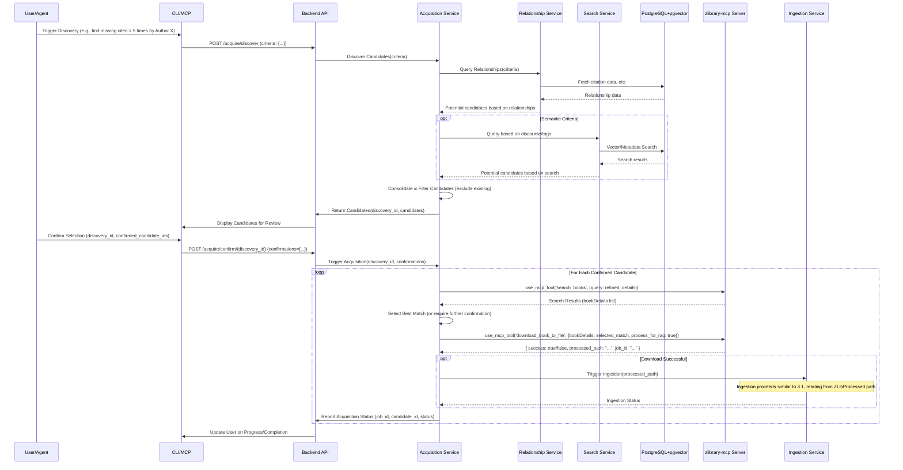
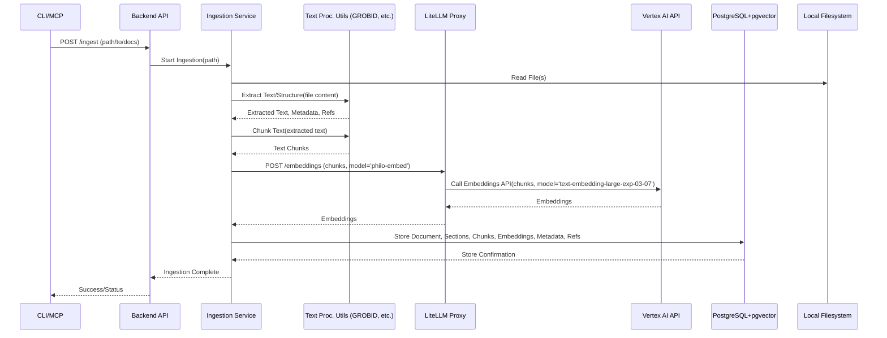
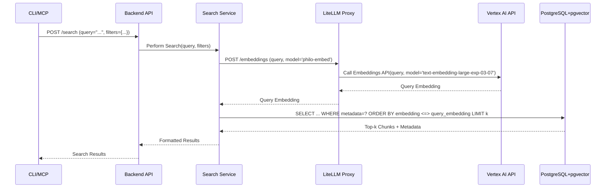
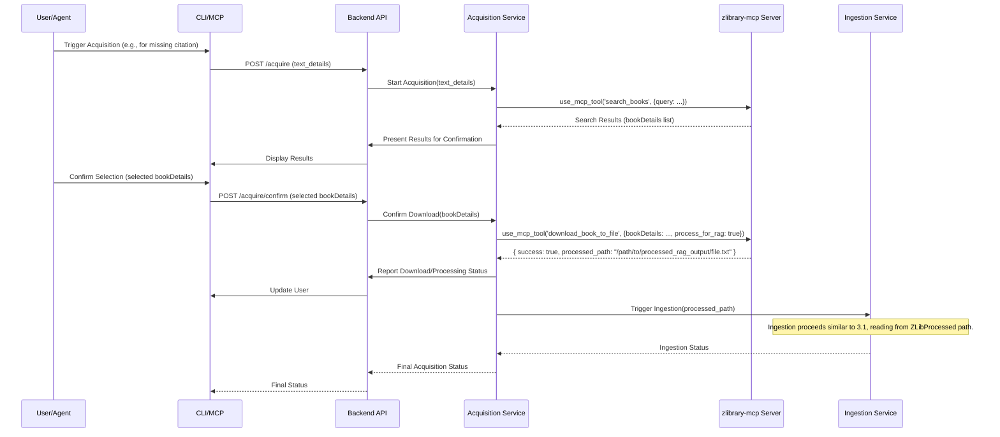

# Architect Specific Memory
<!-- Entries below should be added reverse chronologically (newest first) -->

## Data Models
<!-- Append new data models using the format below -->

### Data Model: Core Schema (PostgreSQL - Tier 0) - [2025-04-27 23:39:30]
- **Purpose**: Store core document, chunk, embedding, and relationship data.
- **Structure**:
  ```sql
  -- Simplified Example
  CREATE EXTENSION IF NOT EXISTS vector;

  CREATE TABLE documents (
      id SERIAL PRIMARY KEY,
      title TEXT,
      author TEXT,
      publication_year INTEGER,
      source_path TEXT UNIQUE, -- Relative path from {{SOURCE_FILE_DIR}}
      metadata JSONB, -- Other extracted metadata
      created_at TIMESTAMPTZ DEFAULT NOW()
  );

  CREATE TABLE sections (
      id SERIAL PRIMARY KEY,
      document_id INTEGER REFERENCES documents(id),
      title TEXT,
      level INTEGER, -- e.g., 1 for chapter, 2 for subsection
      sequence INTEGER, -- Order within the document/parent section
      created_at TIMESTAMPTZ DEFAULT NOW()
  );

  CREATE TABLE chunks (
      id SERIAL PRIMARY KEY,
      document_id INTEGER REFERENCES documents(id),
      section_id INTEGER REFERENCES sections(id), -- Optional, if chunk belongs to a section
      text_content TEXT NOT NULL,
      sequence INTEGER, -- Order within the section/document
      embedding VECTOR(768), -- Recommended dimension (pending validation)
      metadata JSONB, -- e.g., page number
      created_at TIMESTAMPTZ DEFAULT NOW()
  );

  CREATE TABLE relationships (
      id SERIAL PRIMARY KEY,
      source_node_id INTEGER NOT NULL, -- Can refer to document_id or chunk_id (needs type indicator)
      target_node_id INTEGER NOT NULL, -- Can refer to document_id or chunk_id (needs type indicator)
      node_type VARCHAR(10) DEFAULT 'document', -- 'document' or 'chunk'
      relation_type VARCHAR(50) NOT NULL, -- e.g., 'cites', 'responds_to'
      metadata JSONB, -- Context, confidence score, etc.
      created_at TIMESTAMPTZ DEFAULT NOW()
  );

  -- Add HNSW Index
  CREATE INDEX ON chunks USING hnsw (embedding vector_cosine_ops); -- Or vector_l2_ops
  ```
- **Relationships**: Foreign keys link sections/chunks to documents. `relationships` table links documents/chunks explicitly.

## Interface Definitions
<!-- Append new interface definitions using the format below -->

### Interface Definition: Backend API - Acquisition Workflow (Tier 0) - [2025-05-04 01:57:11]
- **Purpose**: Allow flexible discovery and confirmation for acquiring missing texts.
#### Method/Endpoint: POST /acquire/discover
- Input: `{ "criteria": { "min_citation_threshold": int, "cited_by_author": str, "collection_id": int, "tags": list[str], "discourse_query": str }, "exclude_existing": bool }`
- Output: `{ "discovery_id": "uuid", "candidates": [ { "candidate_id": "str", "title": "str", "author": "str", "year": int, "reason": "str", "potential_sources": list } ] }`
- Behavior: Initiates discovery based on criteria, interacting with Relationship/Search services. Returns candidates and a session ID.
- Security: None (Local Tier 0)
#### Method/Endpoint: POST /acquire/confirm/{discovery_id}
- Input: Path param `discovery_id`. Body: `{ "confirmations": [ { "candidate_id": "str", "acquisition_details": { "title": "str", "author": "str" } } ] }`
- Output: `{ "status": "str", "triggered_acquisitions": [ { "candidate_id": "str", "acquisition_job_id": "str" } ] }`
- Behavior: Confirms candidates for the given discovery session. Triggers acquisition via `zlibrary-mcp` for confirmed items.
- Security: None (Local Tier 0)
### Interface Definition: Backend API (Internal REST - Tier 0) - [2025-04-27 23:39:30]
- **Purpose**: Allow CLI/MCP clients to interact with PhiloGraph core services.
#### Method/Endpoint: POST /ingest
- Input: `{ "path": "path/to/source" }`
- Output: `{ "status": "started", "job_id": "..." }` or error
- Behavior: Triggers the asynchronous ingestion process for the specified file or directory path.
- Security: None (Local Tier 0)
#### Method/Endpoint: POST /search
- Input: `{ "query": "search term", "filters": { "author": "...", "year": ... }, "limit": 10 }`
- Output: `{ "results": [ { "chunk_id": ..., "text": "...", "score": ..., "metadata": {...} } ] }` or error
- Behavior: Generates query embedding via LiteLLM, performs vector search + filtering in DB, returns ranked results.
- Security: None (Local Tier 0)
#### Method/Endpoint: GET /documents/{doc_id}
- Input: Document ID
- Output: `{ "id": ..., "title": ..., "author": ..., "metadata": {...} }` or error
- Behavior: Retrieves metadata for a specific document.
- Security: None (Local Tier 0)

#### Method/Endpoint: POST /acquire
- Input: `{ "text_details": { "title": "...", "author": "..." } }` or `{ "missing_id": "..." }`
- Output: `{ "status": "searching/confirming/downloading/processing/complete/error", "results": [...], "processed_path": "..." }`
- Behavior: Initiates the text acquisition workflow via the Acquisition Service, potentially returning search results for confirmation before proceeding with download and processing via `zlibrary-mcp`.
- Security: None (Local Tier 0)
### Component Specification: Backend Service (Tier 0 - Updated Acquisition) - [2025-05-04 01:57:11]
- **Responsibility**: Orchestrates core logic, exposes API, manages workflows (ingestion, search, **acquisition discovery/confirmation**).
- **Dependencies**: PostgreSQL+pgvector, LiteLLM Proxy, Text Processing Utilities, Local Filesystem, **zlibrary-mcp Server**.
- **Interfaces Exposed**: Internal REST API (e.g., `/ingest`, `/search`, `/acquire/discover`, `/acquire/confirm/{id}`).
- **Internal Structure (Tier 0)**: Monolithic Flask/FastAPI application containing Ingestion, Search, Relationship, Bibliography, and **Text Acquisition** service logic. Runs in Docker.

### Component Specification: Acquisition Service (Tier 0 - Updated) - [2025-05-04 01:57:11]
- **Responsibility**: Orchestrates the flexible workflow for discovering and acquiring missing texts. Handles discovery requests based on criteria, manages discovery sessions, handles confirmation requests, initiates `zlibrary-mcp` calls for confirmed items, and triggers ingestion.
- **Dependencies**: Backend API, Relationship Service, Search Service, Database (PostgreSQL), zlibrary-mcp Server, Ingestion Service.
- **Interfaces Exposed**: Internal API used by Backend API endpoints (`/acquire/discover`, `/acquire/confirm/{id}`).
- **Internal Structure (Tier 0)**: Module within the Backend Service application.

### Component Specification: Relationship Service (Tier 0 - Updated) - [2025-05-04 01:57:11]
- **Responsibility**: Manages storage and retrieval of explicit relationships (primarily citations). Provides data for acquisition discovery criteria (e.g., citation counts, cited-by links).
- **Dependencies**: Database (PostgreSQL).
- **Interfaces Exposed**: Internal API used by other Backend services (e.g., Acquisition Service).
- **Internal Structure (Tier 0)**: Module within the Backend Service application.

### Interface Definition: LiteLLM Proxy (OpenAI-Compatible REST - Tier 0) - [2025-04-27 23:39:30]
- **Purpose**: Provide a unified endpoint for internal services to request embeddings.
#### Method/Endpoint: POST /embeddings
- Input: OpenAI-compatible request body `{ "input": ["text1", "text2", ...], "model": "philo-embed" }`
- Output: OpenAI-compatible response body `{ "data": [ { "embedding": [...] }, ... ], "model": ..., "usage": ... }` or error
- Behavior: Routes request to configured backend (Vertex AI), handles API key injection, retries, etc. Returns embeddings.
- Security: Potentially Virtual Keys configured in LiteLLM.

## Component Specifications
<!-- Append new component specs using the format below -->

### Component Specification: Backend Service (Tier 0) - [2025-04-27 23:39:30]
- **Responsibility**: Orchestrates core logic, exposes API, manages workflows (ingestion, search).
- **Dependencies**: PostgreSQL+pgvector, LiteLLM Proxy, Text Processing Utilities, Local Filesystem.
- **Interfaces Exposed**: Internal REST API (e.g., `/ingest`, `/search`).
### Diagram: PhiloGraph Tier 0 Text Acquisition Workflow (Discovery & Confirmation) - [2025-05-04 01:57:11]
- Description: Sequence diagram for acquiring missing texts via discovery and confirmation steps, using the external zlibrary-mcp server.

**Notes:** Replaces the previous simpler acquisition workflow. Introduces a two-step process with explicit discovery and confirmation. Relies on Relationship and Search services for discovery criteria.
- **Internal Structure (Tier 0)**: Monolithic Flask/FastAPI application containing Ingestion, Search, Relationship, Bibliography, and **Text Acquisition** service logic. Runs in Docker.

### Component Specification: LiteLLM Proxy (Tier 0) - [2025-04-27 23:39:30]
- **Responsibility**: Unified gateway for all external LLM/embedding API calls. Manages keys, routing, retries, basic cost tracking.
- **Dependencies**: External Cloud API (Vertex AI), Network access.
- **Interfaces Exposed**: OpenAI-compatible REST endpoint (e.g., `/embeddings`).
- **Internal Structure (Tier 0)**: Standard LiteLLM Proxy Docker container configured via `config.yaml` and environment variables.

### Component Specification: PostgreSQL+pgvector (Tier 0) - [2025-04-27 23:39:30]
- **Responsibility**: Persistent storage for metadata, text chunks, embeddings, relationships, collections.
- **Dependencies**: Docker volume for persistence.
- **Interfaces Exposed**: Standard PostgreSQL port.
- **Internal Structure (Tier 0)**: Standard PostgreSQL Docker container with pgvector extension enabled.

### Component Specification: Text Processing Utilities (Tier 0) - [2025-04-27 23:39:30]
- **Responsibility**: Extract text/structure (GROBID, PyMuPDF), chunk text (semchunk), parse citations (AnyStyle).
- **Dependencies**: Local CPU resources, potentially separate Docker containers (e.g., for GROBID).
- **Interfaces Exposed**: Varies (e.g., GROBID API, Python library calls).
- **Internal Structure (Tier 0)**: Combination of Python libraries within Backend container and potentially separate Docker containers for tools like GROBID/AnyStyle.

### Component Specification: zlibrary-mcp Server (External - Tier 0) - [2025-04-28 03:32:04]
- **Responsibility**: Provides programmatic access to Z-Library for searching, downloading, and pre-processing texts for RAG. Acts as an external MCP server.
- **Dependencies**: Node.js, Python 3.9+, Z-Library Account Credentials, Network Access. Runs as a separate local process.
- **Interfaces Exposed**: MCP Tools (`search_books`, `download_book_to_file`, `process_document_for_rag`, etc.).
- **Internal Structure**: Node.js/TypeScript application with Python bridge. Manages its own Python venv and a forked `zlibrary` library. (Ref: `zlibrary-mcp` README).

## System Diagrams
<!-- Append new diagrams using the format below -->

### Diagram: PhiloGraph Tier 0 MVP High-Level - [2025-04-27 23:39:30]
- Description: High-level component overview for Tier 0 local deployment with cloud embeddings via LiteLLM proxy.
```mermaid
graph TD
    subgraph "User Interfaces (Local)"
        CLI[CLI Client]
        MCPServer[MCP Server (Local)]
    end

    subgraph "Backend Service (Docker)"
        style Backend Service fill:#ccf,stroke:#333,stroke-width:2px
        API[Backend API (Flask/FastAPI)]
        IngestionService[Ingestion Service]
        SearchService[Search Service]
        RelationService[Relationship Service (Basic)]
        BiblioService[Bibliography Service (Basic)]
    end

    subgraph "Text Processing Utilities (Docker / within Backend)"
        style Text Processing Utilities fill:#fcc,stroke:#333,stroke-width:2px
        GROBID[GROBID (CPU)]
        PyMuPDF[PyMuPDF/ebooklib]
        SemChunk[semchunk (CPU)]
        AnyStyle[AnyStyle (Optional)]
    end

    subgraph "Middleware (Docker)"
        style Middleware fill:#cfc,stroke:#333,stroke-width:2px
        LiteLLMProxy[LiteLLM Proxy]
    end

    subgraph "Storage (Docker)"
        style Storage fill:#f9d,stroke:#333,stroke-width:2px
        PostgresDB[(PostgreSQL + pgvector)]
    end

    subgraph "External Cloud Services"
        style External Cloud Services fill:#eee,stroke:#666,stroke-width:1px
        VertexAI{{Vertex AI Embeddings API}}
    end

    subgraph "Local Filesystem"
        style Local Filesystem fill:#ddd,stroke:#666,stroke-width:1px
        SourceFiles[/Source Documents/]
    end

    %% Connections
    CLI --> API
    MCPServer --> API

    API -- Orchestrates --> IngestionService
    API -- Orchestrates --> SearchService
    API -- Orchestrates --> RelationService
    API -- Orchestrates --> BiblioService

    IngestionService -- Uses --> GROBID
    IngestionService -- Uses --> PyMuPDF
    IngestionService -- Uses --> SemChunk
    IngestionService -- Uses --> AnyStyle
    IngestionService -- Reads --> SourceFiles
    IngestionService -- Requests Embeddings --> LiteLLMProxy
    IngestionService -- Writes --> PostgresDB

    SearchService -- Requests Embeddings --> LiteLLMProxy
    SearchService -- Queries --> PostgresDB

    RelationService -- Reads/Writes --> PostgresDB
    BiblioService -- Reads/Writes --> PostgresDB

    LiteLLMProxy -- Calls --> VertexAI
```
**Notes:** See `docs/architecture/tier0_mvp_architecture.md` for full details.

### Diagram: PhiloGraph Tier 0 Ingestion Workflow - [2025-04-27 23:39:30]
- Description: Sequence diagram for the Tier 0 document ingestion process.


### Diagram: PhiloGraph Tier 0 Search Workflow - [2025-04-27 23:39:30]
- Description: Sequence diagram for the Tier 0 search process.


### Diagram: PhiloGraph Tier 0 Text Acquisition Workflow - [2025-04-28 03:32:04]
- Description: Sequence diagram for acquiring missing texts via the external zlibrary-mcp server.
